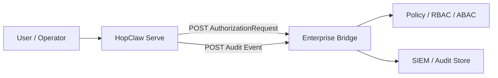

# Enterprise Webhook Quickstart

This guide shows the smallest realistic `toB` setup that does **not** require
patching HopClaw core:

- external AuthZ via `authz.webhook`
- external audit export via `runtime.audit.sinks[].webhook`
- optional local JSONL audit trail

Important product rule:

- these features are **opt-in**
- standalone `toC` usage is unchanged when you do not configure them

## When To Use This

Use this path when you want HopClaw to stay business-neutral while your outer
system owns:

- org / role / tenant modeling
- business RBAC / ABAC
- SIEM or audit forwarding
- portal or ChatOps wrappers

## Architecture



## Why `toC` Is Not Affected

HopClaw still defaults to the local-friendly flow:

- no `authz.webhook` -> gateway falls back to an injected decider,
  `contrib/authz-rbac` through `auth.rbac`, or finally `OpenDecider`
- no `runtime.audit.sinks` -> no outbound audit webhook delivery
- plain `hopclaw` interactive use does not need enterprise policy plumbing

That means:

- `toC` keeps a low-friction startup path
- `toB` gets stronger integration surfaces only when explicitly configured

## 1. Run The Example Enterprise Bridge

The repo now includes a minimal bridge example:

- [`../examples/enterprise-bridge-template/`](../examples/enterprise-bridge-template)

Start it with:

```bash
go run ./examples/enterprise-bridge-template/go
```

By default it listens on `127.0.0.1:18081`.

## 2. Start HopClaw With The Example Enterprise Config

Use the example config:

- [`../examples/enterprise-bridge-template/hopclaw.enterprise.yaml`](../examples/enterprise-bridge-template/hopclaw.enterprise.yaml)

Run:

```bash
export HOPCLAW_AUTH_TOKEN=dev-hopclaw-token
export HOPCLAW_OPERATOR_KEY=dev-operator-key
export BRIDGE_SHARED_TOKEN=dev-bridge-token

hopclaw serve --config examples/enterprise-bridge-template/hopclaw.enterprise.yaml
```

What this example enables:

- gateway auth through `auth.api_keys`
- external policy decisions through `authz.webhook`
- local file audit through `runtime.audit.output`
- outbound audit relay through `runtime.audit.sinks[].webhook`

## 3. Verify The Integration Surfaces

Check AuthZ summary:

```bash
curl -H "X-API-Key: ${HOPCLAW_OPERATOR_KEY}" \
  http://127.0.0.1:16280/operator/authz
```

Check control-plane status:

```bash
curl -H "X-API-Key: ${HOPCLAW_OPERATOR_KEY}" \
  http://127.0.0.1:16280/operator/controlplane/status
```

Check audit sink registry:

```bash
curl -H "X-API-Key: ${HOPCLAW_OPERATOR_KEY}" \
  http://127.0.0.1:16280/operator/audit/sinks
```

## 4. What The Example Bridge Actually Does

The sample bridge is intentionally simple:

- `/authz/decide` receives `authz.AuthorizationRequest`
- `/audit/events` receives runtime `eventbus.Event`
- `X-Bridge-Token` acts as a tiny shared-secret gate for demo purposes

In a real deployment you would replace that bridge with:

- your RBAC / ABAC service
- OPA or policy microservice
- SIEM ingestion edge
- internal portal backend

## Recommended Production Direction

For a real enterprise deployment:

- keep business identity and tenant isolation outside HopClaw
- use `authz.webhook` for policy delegation
- use `exec_approval.providers[].webhook` for human approval systems
- use `runtime.governance.adapters[].webhook` for governance delivery
- use `runtime.audit.sinks[].webhook` plus `runtime.audit.output` for audit fan-out

## Related Docs

- [`./reference/config-reference.md`](./reference/config-reference.md)
